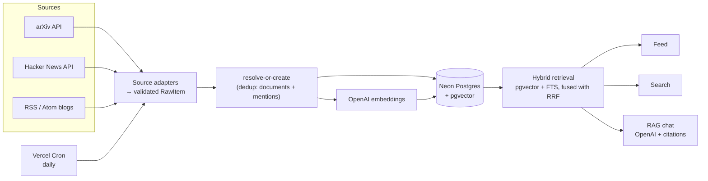

# News Floater

**Live demo → [news-floater.vercel.app](https://news-floater.vercel.app/)**

An AI/ML research aggregator. It ingests papers and posts from multiple sources, deduplicates them
across sources into a single corpus, and serves three views over it: a **feed**, **hybrid semantic
search**, and a **grounded RAG chat** that answers only from the corpus and cites its sources.

The corpus updates itself daily via a scheduled job — the feed is always current.

## Sources

- **arXiv** — cs.CL, cs.AI, cs.LG (Atom API)
- **Hacker News** — AI/ML stories (Algolia API)
- **AI blogs** via RSS/Atom — [OpenAI](https://openai.com/news/), [Google DeepMind](https://deepmind.google/blog/), [Hugging Face](https://huggingface.co/blog), [Simon Willison](https://simonwillison.net/)

## What it does

- **Ingests** from three source types behind one adapter interface — adding a source is
  implementing a single interface; nothing downstream changes.
- **Deduplicates across sources** — the same paper appearing on both arXiv and Hacker News collapses
  into **one** document carrying both signals (arXiv abstract + HN score/comments).
- **Hybrid search** — vector similarity (pgvector) fused with Postgres full-text search via
  Reciprocal Rank Fusion, so exact tokens (model names, acronyms like `RLHF`) _and_ semantic
  paraphrases both work.
- **Grounded RAG chat** — retrieves the top sources, answers only from them with inline `[n]`
  citations, and explicitly declines ("not in the corpus") rather than hallucinating.

## Architecture



- **Ingestion** splits into a one-shot local **backfill** and a small, idempotent **incremental
  sync** (Vercel Cron) — so the scheduled job stays serverless-friendly and re-runs safely.
- **Dedup** uses a `documents` + `mentions` model: one canonical work, one row per source
  appearance. Resolution is order-independent (arXiv-before-HN and HN-before-arXiv converge).
- **Retrieval** is hybrid and returns ranked candidates (a re-ranker can slot in later).

## Tech stack

- **Next.js 16** (App Router, RSC) + **TypeScript** (strict)
- **Neon** Postgres + **pgvector**, via **Drizzle ORM** (typed schema → checked-in SQL migrations)
- **OpenAI** for both embeddings (`text-embedding-3-small`) and chat (`gpt-4o-mini`), behind a thin
  provider seam
- **Vercel AI SDK** (`ai` + `@ai-sdk/openai` + `@ai-sdk/react`) — the provider abstraction for
  embeddings and chat, plus streamed, cited chat via `useChat`
- Deployed on **Vercel** (daily cron-driven sync; per-preview Neon DB branches)

## Design notes

A few things done deliberately (full reasoning + alternatives-considered in
[DECISIONS.md](DECISIONS.md)):

- **Build vs. buy, out loud.** Exa + an LLM could serve the _consumption_ use case faster; the
  pipeline is built to demonstrate the engineering and to own the corpus (curated scope,
  cross-source provenance, no per-query read cost). The tradeoff is documented, not ignored.
- **Retrieval is measured, not asserted.** A small eval set (hit@k / MRR across
  keyword/semantic/hybrid) drives tuning — and the writeup is honest that a lexical ground-truth
  proxy flatters keyword search, so hybrid is kept for robustness.
- **External data is validated at the boundary** with Zod (arXiv XML, HN JSON, RSS/Atom) — never
  `any`-typed.
- **Idempotent, observable ingestion** — upsert by stable keys; every run logged to
  `ingestion_runs`; per-source failures isolated so one bad source can't kill a run.
- **Single-provider LLM stack** behind a seam — Anthropic has no embedding model, so unifying on
  OpenAI means one key/bill/cap, and Claude stays a one-line swap.

## Local setup

Requires Node 20+ and [pnpm](https://pnpm.io).

```bash
pnpm install
cp .env.example .env.local   # fill in the values
pnpm db:migrate              # apply migrations to your Neon database
pnpm ingest:backfill         # pull the corpus (arXiv + HN + RSS)
pnpm embed:backfill          # embed new documents
pnpm dev                     # http://localhost:3000
```

`.env.local` needs a Neon database (pooled + direct connection strings), an `OPENAI_API_KEY`, and a
`CRON_SECRET`. See [.env.example](.env.example).

## Scripts

| Command                                                      | Purpose                                                     |
| ------------------------------------------------------------ | ----------------------------------------------------------- |
| `pnpm dev` / `pnpm build`                                    | Dev server / production build                               |
| `pnpm typecheck` · `pnpm test` · `pnpm lint` · `pnpm format` | Checks (TS, Vitest, ESLint, Prettier)                       |
| `pnpm db:generate` · `pnpm db:migrate` · `pnpm db:studio`    | Drizzle migrations / studio                                 |
| `pnpm ingest:backfill`                                       | Backfill the corpus from all sources                        |
| `pnpm embed:backfill`                                        | Embed documents lacking embeddings (`--force` to re-embed)  |
| `pnpm eval:retrieval`                                        | Retrieval eval (hit@k / MRR, keyword vs semantic vs hybrid) |

## What's next

- Re-ranking over the hybrid candidates (Cohere/Voyage) — the seam is already in place.
- Full-text embedding for blog posts (currently abstract/summary only).
- Exa-backed discovery to widen ingestion beyond a fixed source list.
